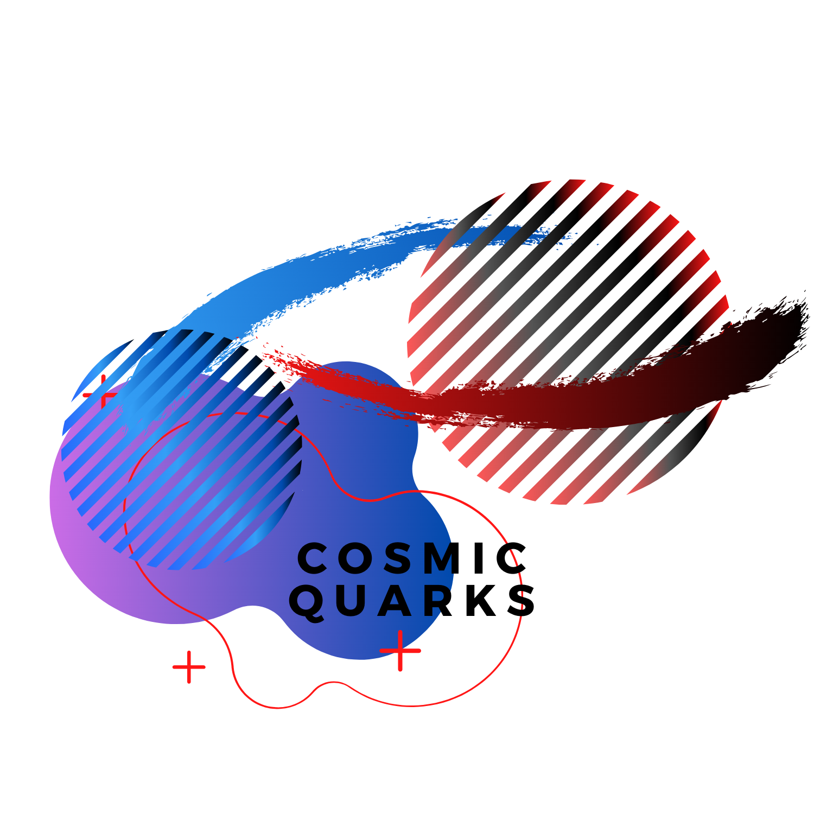

# Cosmic-Quarks

### Who are we?

 We are a Astrophysics team under SSERD IPD working on finding a relation that accounts for the mass transfer from a companion star to a black hole, which would help us conclude the mass conservation and find if there is any discrepancy, which we call as the ghost mass and use reference systems for validation of ghost mass problem and accounting for the discrepancy using models/computation.

 ### A Short Introduction:

 Having been inspired from the Cygnus-X1 system, the goal was to set up a similar binary system model and analyse some fundamental properties. We introduce a hypothetical binary system that consists of a stellar mass black hole, and an intermediate mass main sequence star. The base model builds up on the fact that mass from the star transfers to the black-hole via accretion. This leads to the inclusion of different types of mass transfers that take place in this whole process: Mass transfers due to stellar winds, Roche lobe overflows, advective outflows from the accretion disk, and astrophysical jets.

 Upon closer look, these mass transfers are actually the cause of mass losses that occurs during the transfer from a star to a black-hole. So, not all the mass is conserved. This mass discrepancy we term as Ghost Mass. The mass gained by the black-hole is not equivalent to the mass lost by the star.

Our work in summary started off with intense literature review of what systems we could take into consideration, and what mass transfers we could account for. Having singled those out, we then proceeded with our analysis in the following manner:

1. With the governing equations for mass transfer, we set up a model and obtained plots that showed how different parameters varied with respect to another.
2. We obtained a rough simulation outlining the evolutionary process.
3. With the model in place, we took 3 systems and analytically calculated their respective ghost masses.
4. We then did a fit analysis that compared these ghost masses to that of what our model showed. The deviation of these points from the plane graph shows how unfeasible the system is with respect to our model.

### The Team:

1. **Adhiraj Bhagawati**,  School of Computing, SRM Institute of Science and Technology, Chennai.

2. **Akshita Swaminathan**, Department of Aerospace Engineering, SRM Institute of Science and Technology, Chennai 
 
3. **Alice I**,Karunya University, Coimbatore 

4. **Ashika A**,Amrita Vishwa Vidyapeetham, Coimbatore 

5. **Aswathi P S**,Amrita Vishwa Vidyapeetham, Coimbatore 

6. **Bhakti Mithagri**, Department of Physics, Ramnarain Ruia College, Mumbai 

7. **Keerthi P S**, Amrita Vishwa Vidyapeetham, Coimbatore 

8. **Manish Kumar Das**, Department of Geology and Geophysics, Indian Institute of Technology (IIT), Kharagpur 

9. **Parmeshwar Dewangan**, Center for Basic Sciences, Pt. Ravishankar Shukla University, Raipur 

10. **Raj Panchal**, Thakur College of Science and Commerce 

11. **Rutanshi Pradhan** ,Center for Basic Sciences, Pt. Ravishankar Shukla University, Raipur 

12. **Sahasra S**,Psg college of arts and science,coimbatore 

13. **Sahasransu Mohanty**, School of Applied Sciences,CUTM. 

14. **Shradha Ramakrishnan**, Amrita Vishwa Vidyapeetham 

15. **Sreeranjini.P.U** ,Amrita Viswa Vidyapeetham, Coimbatore 

16. **Sruthi P V**,Amrita Viswa Vidyapeetham, Coimbatore 

17. **S.Syamadas** ,Amrita Vishwa Vidyapeetham, Coimbatore 

18. **Suneet Ranjan Khuntia**,Aerospace engineering, Chandigarh University

### Mentor:

1. Mr. Sundar M.N.

